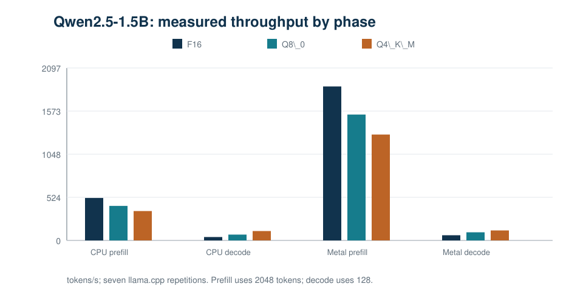
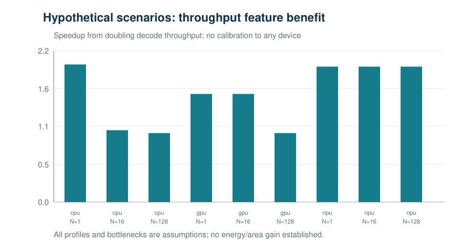
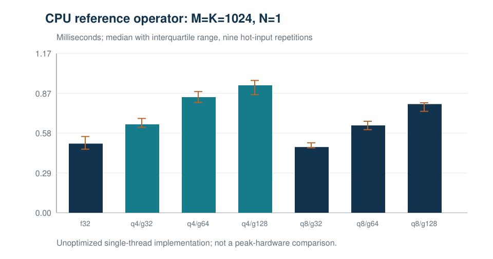
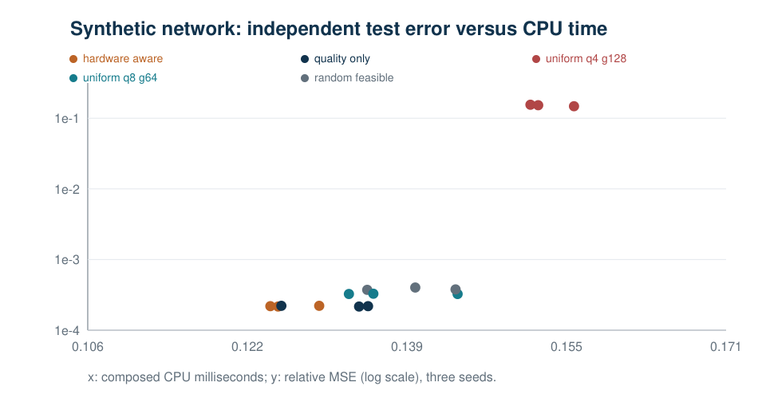

# EdgeDecode

<p align="center">
  
  
  
</p>

A research prototype for understanding when the inference boundary moves between CPU and accelerator-friendly execution paths on edge-class systems.

## Project goal

This project asks a concrete hardware question:

> How do model scale, context length, generation length, and software blocking change the point where prefill and decode stop behaving like the same workload?

The focus is not a generic "CPU vs GPU" statement. The focus is a more useful question:

> Which phase is dominant, and which execution path fits that phase best?

---

## Why this matters

LLM inference is not one monolithic task. It is a combination of at least two very different workloads:

| Phase | What happens | Why it matters |
|---|---|---|
| Prefill | Long prompt/context is processed in bulk | Large memory and bandwidth pressure; often dominated by dense compute |
| Decode | Tokens are generated one by one | Streaming workload; weight access and latency become central |

These phases do not share the same bottleneck. That is why a single hardware verdict is usually misleading.

---

## Research narrative

EdgeDecode is built to expose this boundary clearly and measure it with real execution evidence instead of a single abstract rule.

### Core claim

The winning execution path depends on the phase, not just the model or the device.

- Decode-heavy workloads benefit strongly from lower-precision formats.
- Prefill-heavy workloads may still favor a different precision and backend path.
- The boundary shifts as context length and software blocking change.

This is the main scientific theme of the project.

---

## Highlighted results

### Measured on Apple M4 Pro

<p align="center">
  
</p>

The measured data shows that the same model can prefer different formats depending on whether the bottleneck is prefill or decode.

| Format | Model size | WikiText-2 PPL | HellaSwag accuracy | CPU decode | Metal decode |
|---|---:|---:|---:|---:|---:|
| F16 | 3.56 GB | 8.9573 | 61.5% | 40.95 tokens/s | 62.78 tokens/s |
| Q8_0 | 1.89 GB | 8.9524 | 61.5% | 70.81 tokens/s | 98.76 tokens/s |
| Q4_K_M | 1.12 GB | 9.3102 | 60.0% | 113.99 tokens/s | 121.29 tokens/s |

### Phase split in plain terms

- Q4_K_M is fastest for decode.
- F16 remains strongest for Metal prefill.
- Q8_0 remains close to F16 quality while offering lower size and strong efficiency.

This is the central evidence pattern behind the project.

---

## Figure gallery

The project includes a set of paper figures and evidence views for the resulting analysis.

<p align="center">
  <a href="paper/figures/architecture.png"></a>
  <a href="paper/figures/operator.png"></a>
  <a href="paper/figures/search.png"></a>
  <a href="paper/figures/stage2-performance.png"></a>
</p>

- [Architecture view](paper/figures/architecture.pdf)
- [Operator view](paper/figures/operator.pdf)
- [Search-space view](paper/figures/search.pdf)
- [Stage-2 performance view](paper/figures/stage2-performance.pdf)
- [Working paper](paper/main.pdf)

---

## Measured performance snapshot

### CPU throughput

| Phase | F16 | Q8_0 | Q4_K_M |
|---|---:|---:|---:|
| pp128 | 325.69 tokens/s | 449.84 tokens/s | 423.20 tokens/s |
| pp2048 | 516.13 tokens/s | 419.67 tokens/s | 357.34 tokens/s |
| tg128 | 40.95 tokens/s | 70.81 tokens/s | 113.99 tokens/s |

### Metal throughput

| Phase | F16 | Q8_0 | Q4_K_M |
|---|---:|---:|---:|
| pp128 | 1629.82 tokens/s | 1591.19 tokens/s | 1406.20 tokens/s |
| pp2048 | 1872.16 tokens/s | 1530.36 tokens/s | 1287.24 tokens/s |
| tg128 | 62.78 tokens/s | 98.76 tokens/s | 121.29 tokens/s |

---

## Decision signal

The project intentionally avoids a universal "one quantization rule".

Instead, the measured evidence supports this conclusion:

> Precision choice is phase- and backend-dependent.

The design implication is therefore phase-aware inference architecture:

1. keep a dense, high-throughput prefill path
2. optimize a distinct decode path for token generation and weight streaming
3. treat fixed-format recommendations as workload-specific, not universal

---

## Evidence scope

This project is explicit about its boundaries.

- Real GGUF + llama.cpp execution path
- Apple M4 Pro host measurements
- One 1.5B model family
- No measured Arm GPU/NPU result
- No silicon-area product claim
- No universal low-precision recommendation

The repository keeps measured results, quality checks, and hypothetical architecture analysis separate.

---

## Quick start

```bash
python3 -m venv .venv
. .venv/bin/activate
python -m pip install -e .
sh scripts/reproduce.sh
```

Optional Metal flow:

```bash
python scripts/build_native.py --metal
python -m edgedecode.experiment --out results/local-metal --backends cpu metal
```

Paper build:

```bash
python -m pip install -r requirements-paper.txt
make paper
```

---

## Repository structure

```text
edgedecode/          Core benchmark and analysis logic
native/              CPU and Metal reference kernels
configs/             Benchmark and scenario configuration files
results/             Measured and synthetic evidence outputs
scripts/             Reproduction and experiment orchestration
tests/               Validation and regression checks
paper/               LaTeX paper source and compiled PDF
docs/                Evidence and format notes
models/              Local GGUF model files
third_party/         Pinned llama.cpp checkout
```

---

## License

MIT.

This project does not bundle third-party model weights or datasets. Those must be obtained separately under their own licenses.
